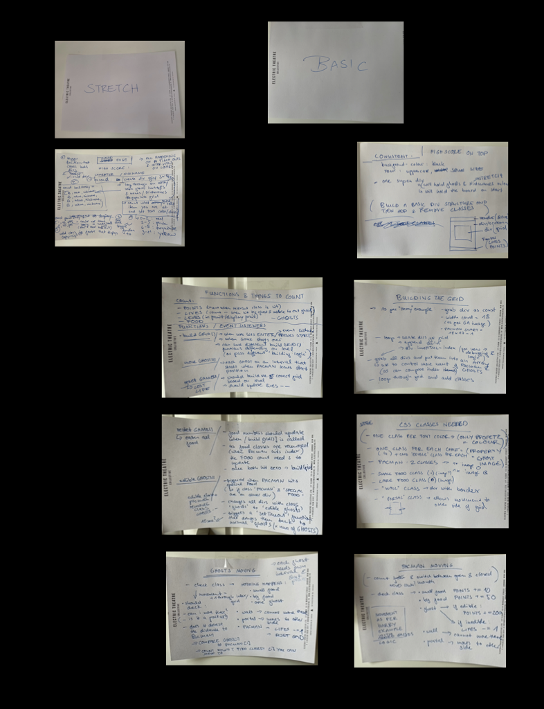
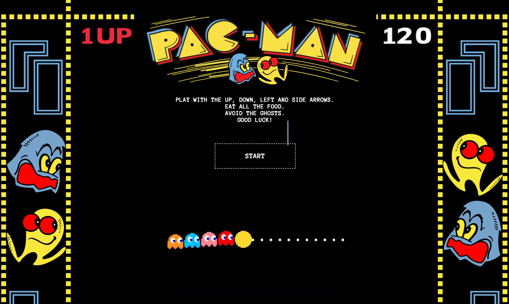
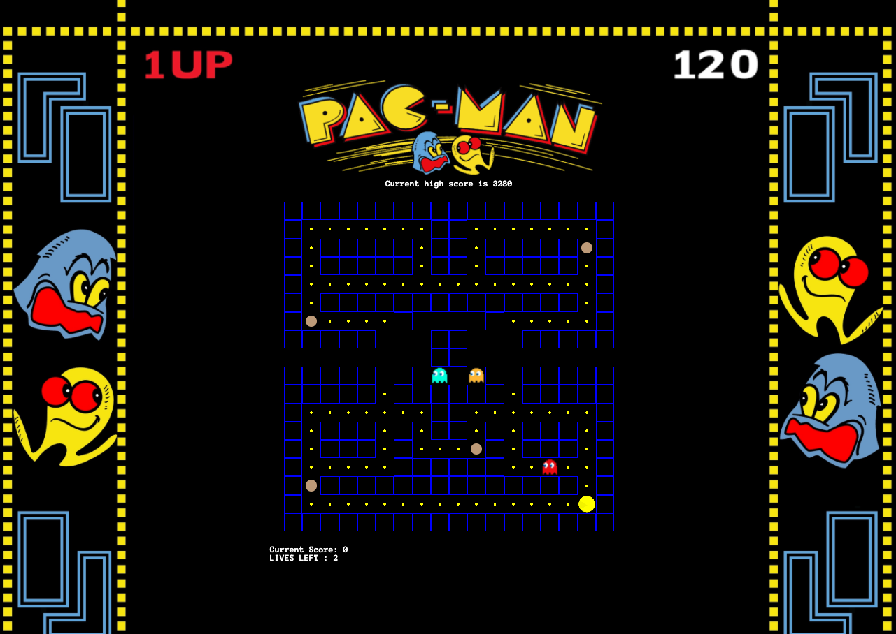

 GENERAL ASSEMBLY — SOFTWARE ENGINEERING IMMERSIVE 2021

# PACMAN
## Project 1

The first app I've ever built- a JavaScript version of Pacman.

[Try it out.](https://khackethal.github.io/project-1/)

No recommendations for best user experience. Get out of the lower right corner fast, as the red ghost is smart enough to know you're there in the beginning. 

## Table of Contents

1. [Brief](https://github.com/khackethal/project-1#brief)
2. [Approach](https://github.com/khackethal/project-1#approach)
   - [MVP](https://github.com/khackethal/project-1#mvp)
   - [Technologies](https://github.com/khackethal/project-1#technologies)
   - [Planning](https://github.com/khackethal/project-1#planning)
3. [Project Details](https://github.com/khackethal/project-1#project-details)
   - [The Board](https://github.com/khackethal/project-1#the-board)
    - [Classes & Variables](https://github.com/khackethal/project-1#classes--variables)
    - [Ghost movement](https://github.com/khackethal/project-1#ghost-movement)
    - [Random Ghosts](https://github.com/khackethal/project-1#random-ghosts)
     - [Smart Ghost](https://github.com/khackethal/project-1#smart-ghost)
4. [Project Frames](https://github.com/khackethal/project-1#project-frames)
5. [Wins, Challenges & Bugs](https://github.com/khackethal/project-1#wins-challenges--bugs)
6. [Key Learnings and Future Features](https://github.com/khackethal/project-1#key-learnings--future-features)

## Brief

The brief was to create the classic Pacman arcade game, written solely in 'Vanilla JavaScript" using only techniques learned on the course so far, without looking at any external tutorials. Writing the readme one week after the project, even now I would not approach things the same way. But rather than refactoring the game I will explain my approach at the time, with the resources and knowledge available to me.


### Requirements

* The player should be able to clear at least one board
* The player's score should be displayed at the end of the game

### Suggested Enhancements- fullfilled

* Smart Ghosts - one of the Ghosts (red) is fairly smart, the others move on random paths
* Persistent leaderboard using `localStorage` - user highscore is stored and displayed 


## Approach

### MVP

My main focus was to achieve a playable game that takes into account the points Pacman gains as he moves, as well as the ghosts switching between 'edible' and 'non-edible' mode. As smart ghost movement was clearly flagged as a stretch goal by the GA team I focused on polishing the game before moving on to it.


### Technologies
- JavaScript
- HTML
- CSS


## Planning

Having not planned an app before, I found it easiest for this first one to write everything out on cards and have them up next to my workspace. That way I could easily reference them, move them over to the "completed" side once done, or replace them with slightly amended cards if I found something else worked better.

Here is a digital recreation of my wall at the time...




## Project Details


### The Board

I decided to only have one board, which is hardcoded into a JavaScript build function. The only html for the grid is a parent div. 
The width of the board is set to 18, and a FOR LOOP is used to create child divs. Each div is being pushed into an Array as it is created.
This Array is then looped over in order to apply the correct class to each div.
This function to build the grid and seed the classes is run on onClick when the user clicks the START button displayed on page load.


### Classes & Variables

The entire game works based on applying and removing classes to single divs based on user interactions.
Classes are: 

* WALL - immobile class that does not change, and as the name suggests is applied to all walls
* WALKWAY - applied to all remaining divs that do not contain the classname "WALL"
* PORTAL- two special portals on either side of the board, allowing both PACMAN and the GHOSTS to travel through to the other side

Both PACMAN and the GHOSTS use these three classes as reference for their movement (ie WALL - cannot more there, WALKWAY- can move there, PORTAL- move to other side of the board)

* FOOD - small food pebbles
* SPECIAL FOOD - the 4 big food pebbles Pacman can eat to trigger an EDIBLE GHOSTS function

Whenever Pacman has made a move, a function is triggered to check if anything needs to happen based on the class of the div he just entered.
He can only move to a div that has the class "WALWAY" added. 
Pacman himself is a yellow circle with an animation for his mouth opening and closing. Every time he changes direction the animation class also changes, thus ensuring his mouth is pointing in the direction he is travelling.

Animation classes

```js
.pacman_right { animation: changeBgPCR 1s infinite; background-size:cover }
@keyframes changeBgPCR{
    0%,100%  {background-image: url('https://i.imgur.com/VzeQyFZ.png');}
    25% {background-image: url('https://i.imgur.com/3H81OY6.png');}
    50% {background-image: url('https://i.imgur.com/3H81OY6.png');}
    75% {background-image: url('https://i.imgur.com/VzeQyFZ.png');}
}


.pacman_left { animation: changeBgPCL 1s infinite; background-size:cover }
@keyframes changeBgPCL{
    0%,100%  {background-image: url('https://i.imgur.com/VzeQyFZ.png');}
    25% {background-image: url('https://i.imgur.com/AmjLTIR.png');} 
    50% {background-image: url('https://i.imgur.com/AmjLTIR.png');}
    75% {background-image: url('https://i.imgur.com/VzeQyFZ.png');}
}

.pacman_up { animation: changeBgPCU 1s infinite; background-size:cover }
@keyframes changeBgPCU{
    0%,100%  {background-image: url('https://i.imgur.com/VzeQyFZ.png');}
    25% {background-image: url('https://i.imgur.com/j7koYdf.png');} 
    50% {background-image: url('https://i.imgur.com/j7koYdf.png');}
    75% {background-image: url('https://i.imgur.com/VzeQyFZ.png');}
}

.pacman_down { animation: changeBgPCD 1.5s infinite; background-size:cover }
@keyframes changeBgPCD{
    0%,100%  {background-image: url('https://i.imgur.com/VzeQyFZ.png');}
    25% {background-image: url('https://i.imgur.com/YHjR0Da.png');} 
    50% {background-image: url('https://i.imgur.com/YHjR0Da.png');}
    75% {background-image: url('https://i.imgur.com/VzeQyFZ.png');}
}
```

Pacman moving and triggering the ```checkCells()`` function on every move:

```js
//MOVING DOWN
  if (key === 'ArrowDown' && !(pacman > (width ** 2) - width - 1)) {
    cells[pacman].classList.remove('pacman_left')
    cells[pacman].classList.remove('pacman_right')
    cells[pacman].classList.remove('pacman_up')
    cells[pacman].classList.remove('pacman_down')
    pacman += width 
    if (cells[pacman].classList.contains('wall')) {
      pacman -= width
      cells[pacman].classList.add('pacman_down')
    } else {
      cells[pacman].classList.add('pacman_down')
    }
    checkCells()

  //LEFT
  } else if (key === 'ArrowLeft' && (!(pacman % width === 0) || cells[pacman].classList.contains('portal')) ){
    cells[pacman].classList.remove('pacman_left')
    cells[pacman].classList.remove('pacman_right')
    cells[pacman].classList.remove('pacman_up')
    cells[pacman].classList.remove('pacman_down')
    pacman -= 1
    if (cells[pacman].classList.contains('wall')) {
      pacman += 1
      cells[pacman].classList.add('pacman_left')
    } else if (cells[pacman].classList.contains('portal')) {
      cells[pacman].classList.remove('pacman_left')
      pacman += 17
      cells[pacman].classList.add('pacman_left')
    } else {
      cells[pacman].classList.add('pacman_left')
    }
    checkCells()


  // RIGHT
  } else if (key === 'ArrowRight' && !(pacman % width === width - 1)) {
    cells[pacman].classList.remove('pacman_left')
    cells[pacman].classList.remove('pacman_right')
    cells[pacman].classList.remove('pacman_up')
    cells[pacman].classList.remove('pacman_down')
    pacman += 1
    if (cells[pacman].classList.contains('wall')) {
      pacman -= 1
      cells[pacman].classList.add('pacman_right')
    } else if (cells[pacman].classList.contains('portal')) {
      cells[pacman].classList.remove('pacman_right')
      pacman -= 17
      cells[pacman].classList.add('pacman_right')
    } else {
      cells[pacman].classList.add('pacman_right')
    }
    checkCells()

  // UP
  } else if (key === 'ArrowUp' && !(pacman < width)) {
    cells[pacman].classList.remove('pacman_left')
    cells[pacman].classList.remove('pacman_right')
    cells[pacman].classList.remove('pacman_up')
    cells[pacman].classList.remove('pacman_down')
    pacman -= width
    if (cells[pacman].classList.contains('wall')) {
      pacman += width
      cells[pacman].classList.add('pacman_up')
    } else {
      cells[pacman].classList.add('pacman_up')
    }
    checkCells()
  }
})
```

### Ghost movement

I found that if I relied only on Pacman himself to check if he encounters a Ghost he would sometimes 'survive' if a Ghost runs into him when he stands still.
Therefore the Ghosts have their own specialised function to check if they encounter Pacman:

```js

//FUNCTION FOR GHOSTS TO CHECK IF THEY ENCOUNTER PACKMAN
function checkCellsGhosts() {
  if (cells[ghost1].classList.contains('pacman_left') || cells[ghost1].classList.contains('pacman_right') ||
      cells[ghost1].classList.contains('pacman_up') || cells[ghost1].classList.contains('pacman_down') ||
    cells[ghost2].classList.contains('pacman_left') || cells[ghost2].classList.contains('pacman_right') ||
    cells[ghost2].classList.contains('pacman_up') || cells[ghost2].classList.contains('pacman_down') ||
    cells[ghost3].classList.contains('pacman_left') || cells[ghost3].classList.contains('pacman_right') ||
    cells[ghost3].classList.contains('pacman_up') ||  cells[ghost3].classList.contains('pacman_down') ||
    cells[ghost4].classList.contains('pacman_left') || cells[ghost4].classList.contains('pacman_right') ||
    cells[ghost4].classList.contains('pacman_up') || cells[ghost4].classList.contains('pacman_down')) {
    lives -= 1 
    if (lives === 0) {
      gameOver()
  
    } else if (lives > 0 ){
      lostLife()
    }    
  }
}
```

### Random Ghosts

The randomly moving Ghosts are simply on intervals (each with a slightly different time so they move at different speeds). To avoid them speeding up over time each function checks if a Ghost move has currently been triggered and returns if that's the case. If a Ghost can move the function will generate a random number using ```Math.random()``` and depending on the result trigger a move to either left, right, up or down. The likelihood of a Ghost to move in either of these directions is also customised per Ghost. Once given a direction the function checks that:

1) The suggested direction is not the one the Ghost has just come from
2) The suggested direction is not a wall

In both cases the function returns and gets triggered again. As the Ghosts are on fairly short intervals the resulting movement is fairly fast. Once the Ghost has moved the ```checkCellsGhost`` function above gets triggered, and if there are no resulting lost lives or game over the movement then gets triggered again. 

```js
// MOVING GHOST 2 = BLUE ====================================================================================

let isPlaying2 
let intervalID2
function moveGhosts2() {

  if (isPlaying2){
    return
  }

  isPlaying2 = true
  
  intervalID2 = setInterval(() => {


    const move = (Math.floor(Math.random() * 7 ))
    let direction

    //MOVING DOWN FOR 0 & 1 & 6
    if ((move === 0 || move === 1 || move === 6) && direction !== 'up' && !(ghost2 > (width ** 2) - width - 1)) {
      cells[ghost2].classList.remove('ghost2')

      ghost2 += width 
      if (cells[ghost2].classList.contains('wall')) {
        ghost2 -= width
        cells[ghost2].classList.add('ghost2')
      } else {
        cells[ghost2].classList.add('ghost2')
      }
      direction = 'down'
      checkCellsGhosts()

    //LEFT FOR 1 & 2 & 3
    } else if ((move === 1 || move === 2 ) && direction !== 'right' && (!(ghost2 % width === 0) || cells[ghost2].classList.contains('portal')) ){
      cells[ghost2].classList.remove('ghost2')
      ghost2 -= 1
      if (cells[ghost2].classList.contains('wall')) {
        ghost2 += 1
        cells[ghost2].classList.add('ghost2')
      } else if (cells[ghost2].classList.contains('portal')) {
        cells[ghost2].classList.remove('ghost2')
        ghost2 += 17
        cells[ghost2].classList.add('ghost2')
      } else {
        cells[ghost2].classList.add('ghost2')
      }
      direction = 'left'
      checkCellsGhosts()


    // RIGHT FOR 4 
    } else if (move === 4  && direction !== 'left' && !(ghost2 % width === width - 1)) {
      cells[ghost2].classList.remove('ghost2')
      ghost2 += 1
      if (cells[ghost2].classList.contains('wall')) {
        ghost2 -= 1
        cells[ghost2].classList.add('ghost2')
      } else if (cells[ghost2].classList.contains('portal')) {
        cells[ghost2].classList.remove('ghost2')
        ghost2 -= 17
        cells[ghost2].classList.add('ghost2')
      } else {
        cells[ghost2].classList.add('ghost2')
      }
      direction = 'right'
      checkCellsGhosts()

    // UP FOR 5 & 3
    } else if ((move === 5 || move === 3) && direction !== 'down' && !(ghost2 < width)) {
      cells[ghost2].classList.remove('ghost2')
      ghost2 -= width
      if (cells[ghost2].classList.contains('wall')) {
        ghost2 += width
        cells[ghost2].classList.add('ghost2')
      } else {
        cells[ghost2].classList.add('ghost2')
      }
      direction = 'up'
      checkCellsGhosts()
    }
  }, 500)
}

```
### Smart Ghost

The smart movement approach for the Red Ghost is a little more extensive.
To begin with, he has an additional function checking what directions he can currently move in:

```js
//FUNCTION TO CHECK WHAT DIRECTIONS A GHOST CAN MOVE IN 
let moveRight
let moveLeft
let moveUp
let moveDown

//RIGHT 
function checkRight(ghostIndex) {
  if (cells[ghostIndex + 1].classList.contains('walkway') || cells[ghostIndex + 1].classList.contains('portal')) {
    moveRight = true
  } else {
    moveRight = false 
  }
  return moveRight
}

//LEFT
function checkLeft(ghostIndex) {
  if (cells[ghostIndex - 1].classList.contains('walkway') || cells[ghostIndex - 1].classList.contains('portal')) {
    moveLeft = true
  } else {
    moveLeft = false 
  }
  return moveLeft
}

//UP 
function checkUp(ghostIndex) {
  if (cells[ghostIndex - width].classList.contains('walkway')) {
    moveUp = true
  } else {
    moveUp = false 
  }
  return moveUp
}

//DOWN 
function checkDown(ghostIndex) {
  if (cells[ghostIndex + width].classList.contains('walkway')) {
    moveDown = true
  } else {
    moveDown = false 
  }
  return moveDown
}
```

His movement function is below and explained here in steps.
1) Check if a movement has already been triggered and return as so, to avoid speeding up (same as for the Random Ghosts)
2) Check what directions he can currently move in
3) Four functions get triggered, the distance from Pacman in the grid in each direction (up, down, left, right)
4) If the direction is not available to Pacman the distance assigned is automatically '1000', though I could have picked any number larger than the total length of the array - 2
5) The results are pushed into an array ```const choices= []``` and a function is triggered to return the smallest item in the array. Step 4 above ensures that the smallest item is also an available direction and not a WALL.
6) The Red Ghost moves.

The problem with this approach is that it works great both for generally closing in on Pacman and on straight stretches, but not as well around corners. I ended up writing some additional if-else statements to help the Ghost in case of corners and managed to improve him dealing with it. The full code is below.

```js
// MOVING GHOST 1 = RED ====================================================================================

let isPlaying 
let intervalID

function moveGhosts() {

  if (isPlaying){
    return
  }

  isPlaying = true
  
  intervalID = setInterval(() => {

    checkRight(ghost1)
    checkLeft(ghost1)
    checkUp(ghost1)
    checkDown(ghost1)

    //these will be assigend a value and pushed into the choices array
    let right
    let left
    let up
    let down

    //choices array
    const choices = []

    //function to return index of the smallest array item 
    function indexOfSmallest(a) {
      return a.indexOf(Math.min.apply(Math, a))
    }

    function getRight() {
      if (moveRight) {
        right = Math.abs(pacman - (ghost1 + 1)) 
      } else {
        right = 1000
      }
      return right
    }

    function getLeft() {
      if (moveLeft) {
        left =  Math.abs(pacman - (ghost1 - 1))
      } else {
        left = 1000
      }
      return left
    }

    function getDown() {
      if (moveDown) {
        down = Math.abs(pacman - (ghost1 + width))
      } else {
        down = 1000
      }
      return down
    }

    function getUp() {
      if (moveUp) {
        up = Math.abs(pacman - (ghost1 - width))
      } else {
        up = 1000
      }
      return up 
    }

    getRight()
    getLeft()
    getUp()
    getDown()

    choices.push(right) // 0
    choices.push(down) //1
    choices.push(left) // 2
    choices.push(up) //3

    const move = indexOfSmallest(choices)

    //stuck on same row obstacle - packman to right - ghost needs to go down
    if ((pacman - ghost1) < 18 && pacman > ghost1 && cells[ghost1 + 1].classList.contains('wall')) {
      if (moveDown && cells[ghost1 + 1 + width].classList.contains('walkway')) {
        cells[ghost1].classList.remove('ghost1')
        ghost1 += width 
        ghost1 += 1
        cells[ghost1].classList.add('ghost1')
      }
    } else if (pacman > ghost1 && moveUp && cells[ghost1 + 1].classList.contains('wall') && cells[ghost1 + 2].classList.contains('walkway')){
      cells[ghost1].classList.remove('ghost1')
      ghost1 -= width
      cells[ghost1].classList.add('ghost1')
      cells[ghost1].classList.remove('ghost1')
      ghost1 -= width
      cells[ghost1].classList.add('ghost1')
      cells[ghost1].classList.remove('ghost1')
      ghost1 += 1
      cells[ghost1].classList.add('ghost1')
      cells[ghost1].classList.remove('ghost1')
      ghost1 += width
      cells[ghost1].classList.add('ghost1')
    } else if (pacman < ghost1 && cells[ghost1 + 1].classList.contains('wall') && cells[ghost1 - 2].classList.contains('walkway')){
      if (moveLeft) {
        cells[ghost1].classList.remove('ghost1')
        ghost1 -= 1
        cells[ghost1].classList.add('ghost1')
      } else if (cells[ghost1 - width -width + 1].classList.contains('walkway')) {
        cells[ghost1].classList.remove('ghost1')
        ghost1 -= width
        cells[ghost1].classList.add('ghost1')
        cells[ghost1].classList.remove('ghost1')
        ghost1 -= width
        cells[ghost1].classList.add('ghost1')
        cells[ghost1].classList.remove('ghost1')
        ghost1 += 1
        cells[ghost1].classList.add('ghost1')
      }
    } else if (pacman < ghost1 && moveLeft && !moveUp) {
      cells[ghost1].classList.remove('ghost1')
      ghost1 -= 1
      cells[ghost1].classList.add('ghost1')
    }

    // } //RIGHT 
    else if (move === 0 && pacman > ghost1 && !cells[ghost1 + 1].classList.contains('wall') ) {
      cells[ghost1].classList.remove('ghost1')
      ghost1 += 1
      cells[ghost1].classList.add('ghost1')
      if (cells[ghost1].classList.contains('portal')) {
        cells[ghost1].classList.remove('ghost1')
        ghost1 += 17
        cells[ghost1].classList.add('ghost1')
      }
      // direction = 'right'
    } 
    //DOWN
    else if (move === 1 ) {
      cells[ghost1].classList.remove('ghost1')
      ghost1 += width
      cells[ghost1].classList.add('ghost1')
      // direction = 'down'
    } 
    //LEFT
    else if (move === 2 && !cells[ghost1 - 1].classList.contains('wall')) {
      cells[ghost1].classList.remove('ghost1')
      ghost1 -= 1
      cells[ghost1].classList.add('ghost1')
      // direction = 'left'
    } 
    //UP
    else if (move === 3) {
      cells[ghost1].classList.remove('ghost1')
      ghost1 -= width
      cells[ghost1].classList.add('ghost1')

    }
  }, 300)
}
```

## Project Frames

### Start Screen

<p>

</p>

### Game Screen

<p>

</p>

## Wins, Challenges & Bugs

### Wins

This was the first project I ever built, and it was really gratifying to figure out the logic behind it, and tweak the Ghosts. It helped me to really understand JavaScript classes and functions.
It was amazingly fun to see a game come to live based on code I've written after learning for 2 weeks.


### Challenges & Bugs

Looking back I do think my approach to smart Ghost movement was flawed from the beginning, but I had gone so far down that particular road that I wanted to see the best possible outcome I could achieve with it.
There are also simply too many intervals and states, and even if you terminate them all "just in case" in the Lost Life of Game Over function the game sometimes acts a bit buggy.
Specifically the chomp sound that plays on a loop while Pacman is moving sometimes continues on. For the same reason I've built an inelegant hard reset into the game to play again, if I simply rest the board the interval bugs just keep multiplying. 


### Key Learnings & Future Features

The project was an eye opener in terms of how JavaScript classes can create animations, movement and user interactions. 

If I do get time going forward I would like to clear up the sound, and find a solution that does not involve a hard reset between games.
